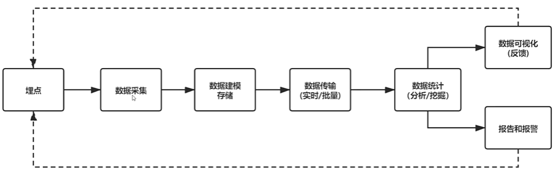

# fe-monitor

> 前端监控系统搭建，monitor system build for frontend         

## 前端监控目的       
* 更快发现问题和解决问题       
* 做产品的决策依据      
* 提升前端工程师的技术深度和广度       
* 为业务扩展提供更多可能性      

## 前端监控目标     
* 稳定性       
* 用户体验      
* 业务能力        

### 稳定性标准  

| 错误类型  | 说明 |        
|  ----  | ----  |       
| JS错误  | JS执行错误或者promise异常 |       
| 资源异常 | script,link等资源加载异常   |
| 接口错误 | ajax或者fetch请求接口异常  |
| 白屏  | 页面空白   |

### 用户体验指标  

| 错误名称 | 说明  |
| ---- | ---- |
| 加载时间  | 各个阶段的加载时间  |
| TTFB(time to first byte)(首字节时间)  | 指浏览器发起第一个请求到数据返回第一个字节所消耗的时间，这个时间包含了网络请求时间、后端处理时间     |       
| FP(first Paint)(首次绘制)   | 首次绘制包括了任何用户自定义的背景绘制，它是将第一个像素点绘制到屏幕的时刻     |       
| FCP(first content Paint)(首次内容绘制)   | 首次内容绘制是浏览器将第一个DOM绘制到屏幕的时间，可以是文本，图像，svg等的时间     |       
| FMP(first meaningful paint)(首次有意义绘制)   |  首次有意义绘制是页面可用性的量度标准    |       
| FID(first input delay)(首次输入延迟)   | 用户首次和页面交互到页面响应交互的时间     |
| 卡顿 | 超过50ms的长任务 |     

### 业务指标      

| 错误名称 | 说明 |
|----|----|
| PV | page view 即页面浏览量或点击量 |
| UV | 指访问某个站点的不同IP地址的人数 |
| 页面的停留时间 | 指用户在每一个页面的停留时间 |

## 前端监控流程

* 前端埋点      
* 数据上报      
* 分析和计算：将采集到的数据进行加工汇总       
* 可视化展示：将数据按照各个维度进行展示       
* 监控报警：发现问题后按一定的条件触发报警      

     

### 常见的埋点方案     

1. 代码埋点     
代码埋点，就是以嵌入代码的形式进行埋点，比如需要监控用户的点击事件，会选择
在用户点击时，插入一段代码，保存这个监控行为或者直接将监控监听行为以某一种
数据格式直接传递给服务器端。      
代码埋点的优势就是可以任意时刻，精准的发送或保存所需要的数据信息；缺点就是
工作量较大。      

2. 可视化埋点        
通过可视化交互的手段，代替代码埋点。      
将业务埋点和埋点代码分离，提供一个可视化交互的页面，输入为业务代码，通过这个
可视化系统，可以在业务代码中自定义的增加埋点事件等，最后输出的代码耦合了业务
代码和埋点代码。        
可视化埋点其实就是用系统来代替手工插入埋点代码。        

3. 无痕埋点             
前端的任意一个事件都被绑定一个标识，所有的事件都被记录下来。      
通过定期上传记录文件，配合文件解析，解析出来我们想要的数据，并生成可视化报告
供专业人员分析。        
无痕埋点的优势就是采集全量数据，不会出现漏埋和误埋等现象；其缺点就是给数据传输
和服务器增加压力，也无法灵活定制数据结构。       

## 编写监控采集脚本

### 日志服务开通      
* [日志服务](https://www.alibabacloud.com/help/zh/product/28958.htm)      
日志服务(Log Service,简称SLS)是针对日志类数据一站式服务，用户无需开发就能
快捷完成数据采集、消费、投递以及查询分析等功能，帮助提升运维，运营效率，建立
DT时代海量日志处理能力        
* [日志服务帮助文档](https://www.aliyun.com/sswd/5126145-1.html)      
* [Web Tracking](https://help.aliyun.com/document_detail/31752.html?spm=5176.2020520112.0.0.5fef34c0nRJ02x#h4--js-sdk)

### 错误监控        
#### 错误分类       
* JS错误      
    JS执行错误      
    promise异常       
* 资源异常    
    监听error
    
### 数据结构设计
#### jsError
````javascript
{
    "title": '前端监控系统', // 页面标题
    "url":"http://localhost:8080", //url
    "timestamp":"159081542541", //访问时间戳
    "userAgent": "Chrome", //用户浏览器类型
    "kind": "stability", // 大类
    "type": "error", // 小类
    "errorType": "jsError", // 错误类型
    "message":"Uncaught TypeError:Cannot set property 'error' of undefined", // 类型详情
    "filename": "http://localhost:8080/", // 访问的文件名
    "position":"0:0", // 行列信息
    "stack":"btnClick(http://localhost：8080/:20:39)^HTMLInputElement.onclick(http://localhost:8080/:14:70)", //堆栈信息 
    "selector":"HTML BODY #container .content INPUT" // 选择器
}
````
#### promiseError
```javascript
{
    "title": '前端监控系统',
    "url":"http://localhost:8080",
    "timestamp":"159081542541",
    "userAgent": "Chrome",
    "kind": "stability",
    "type": "error",
    "errorType": "promiseError",
    "message":"Uncaught TypeError:Cannot set property 'error' of undefined",
    "filename": "http://localhost:8080/",
    "position":"0:0",
    "stack":"btnClick(http://localhost：8080/:20:39)^HTMLInputElement.onclick(http://localhost:8080/:14:70)",
    "selector":"HTML BODY #container .content INPUT"
}
```

#### resourceError
```javascript
{
    "title": '前端监控系统',
    "url":"http://localhost:8080",
    "timestamp":"159081542541",
    "userAgent": "Chrome",
    "kind": "stability",
    "type": "error",
    "errorType": "resourceError",
    "message":"Uncaught TypeError:Cannot set property 'error' of undefined",
    "filename": "http://localhost:8080/",
    "position":"0:0",
    "stack":"btnClick(http://localhost：8080/:20:39)^HTMLInputElement.onclick(http://localhost:8080/:14:70)",
    "selector":"HTML BODY #container .content INPUT"
}
```

#### 实现
1. webpack.config.js     
2. index.html       
3. src/index.js     
4. monitor/index.js     
5. jsError.js       
6. formatTime.js        
7. getLastEvent.js      
8. getSelector.js       
9. tracker.js       

### 接口异常采集脚本
    
#### 接口设计
````javascript
{
    "title":"前端监控系统", // 标题
    "url":"http://localhost:8080/", //url
    "timestamp":"159856862212542", //timestamp
    "userAgent": "Chrome",// 浏览器版本
    "kind": "stability",//大类
    "type":"xhr",//小类
    "eventType":"load",//事件类型
    "pathname":"/success",//路径
    "status":"200-ok",//状态码
    "duration":"7",//持续时间
    "response":"{\"id":1}",//响应内容
    "params":""//参数
}
````

#### 实现

/lib/xhr.js

### 白屏

#### 数据结构设计
````javascript
{
   "title":"前端监控系统",
   "url":"http//localhost:8080/",
   "timestamp":"15985568165442",
   "userAgent": "Chrome",
   "kind":"stability",
   "type":"blank",
   "emptyPoints":"0",
   "screen":"1720*1440", // 分辨率
   "viewPoint":"1720*1440", // 视口
   "selector":"HTML BODY #container"
}
````

#### 实现
* screen:返回当前window的screen对象，返回当前渲染窗口中和屏幕相关的属性      
* innerWidth：只读的window属性，innerWidth返回以像素为单位的窗口的内部宽度     
* innerHeight：窗口的内部高度(布局视口)的高度      
* layout_viewport       
* elementsFromPoint：可以获取到当前视口内指定坐标处，由里到外排列的所有元素     

### 加载时间

* Performance Timing        
* DOMContentLoaded      
* FMP       

#### 阶段含义       

````javascript
字段 描述  计算方式  意义
unload 前一个页面卸载耗时  unloadEventEnd - unloadEventStart -
redirect 重定向耗时 redirectEnd - redirectStart 重定向的时间
appCache 缓存耗时 domainLookupStart - fetchStart 读取缓存的时间
dns DNS解析耗时 domainLookupEnd-domainLookupStart 可观察域名解析服务是否正常
tcp TCP链接耗时 connectEnd - connectStart 建立连接的耗时
ssl SSL安全连接耗时 connectEnd - secureConnectionStart 反映数据安全连接建立耗时   
ttfb Time to First Byte(TTFB)网络请求耗时 responseStart - requestStart TTFB是发出页面请求到接受到应答数据第一个字节所花费的毫秒数
response 响应数据传输耗时 reponseEnd - responseStart 关测网络是否正常
dom DOM解析耗时 domInteractive-responseEnd 观察DOM结构是否合理，是否有JS阻塞页面解析
dcl DOMContentLoaded事件耗时 domContentLoadedEventEnd-domContentLoadedEventStart 当html文档被完全加载和解析完成之后，DOMContentLoaded事件耗时，等待样式表，图像和子框架的完成加载
resources 资源加载耗时 domComplete-domContentLoadedEventEnd 可观察文档流是否过大
domReady DOM阶段渲染耗时 domContentLoadedEventEnd-fetchStart DOM树和页面资源加载完成，会触发domContentLoaded事件
首次渲染耗时 首次渲染耗时 responseEnd-fetchStart 加载文档到看到第一屏非空图像的事件，也叫白屏时间
首次可交互时间 首次可交互时间 domInteractive-fetchStart DOM树解析完成时间此时document.readyState为interactive
首包时间耗时 首包时间 responseStart-domainLookupStart DNS解析到响应浏览器第一个字节的时间
页面完全加载时间 页面完全加载时间 loadEventStart-fetchStart -
onload onLoad事件耗时 loadEventEnd-loadEventStart
````

## License      

[MIT](LICENSE)


